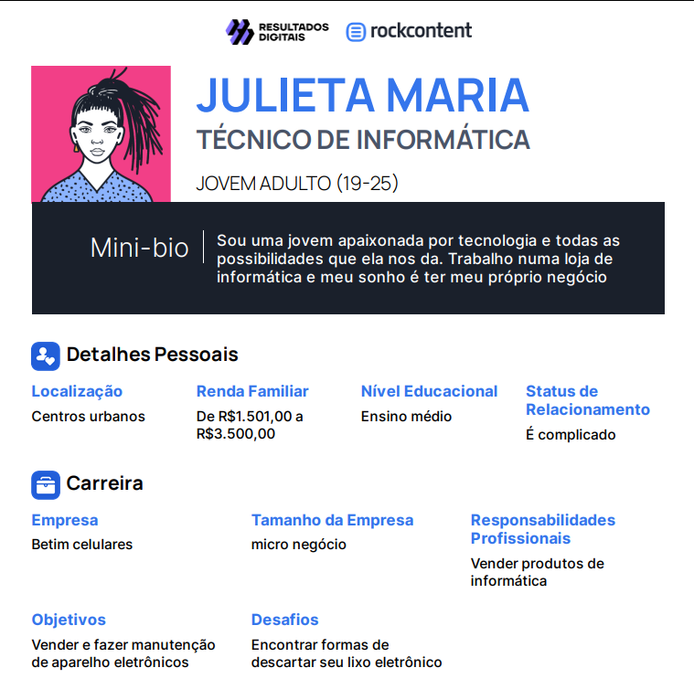

# Informações do Projeto
`TÍTULO DO PROJETO`  

E-WASTE

`CURSO` 

Análise e Desenvolvimento de Sistemas/Sistemas de Informação

## Participantes

Os membros do grupo são: 

> - Rafael Felipe de Paula Silva
> - Pedro Augustto dos Santos Barbosa
> - Davi Lucas do Carmo Nogueira
> - Bernardo Azevedo Estrela
> - Heloisa Almeida de Paula
> - Pedro Henrique Ferreira Gomes Martins

# Estrutura do Documento

- [Informações do Projeto](#informações-do-projeto)
  - [Participantes](#participantes)
- [Estrutura do Documento](#estrutura-do-documento)
- [Introdução](#introdução)
  - [Problema](#problema)
  - [Objetivos](#objetivos)
  - [Justificativa](#justificativa)
  - [Público-Alvo](#público-alvo)
- [Especificações do Projeto](#especificações-do-projeto)
  - [Personas e Mapas de Empatia](#personas-e-mapas-de-empatia)
  - [Histórias de Usuários](#histórias-de-usuários)
  - [Requisitos](#requisitos)
    - [Requisitos Funcionais](#requisitos-funcionais)
    - [Requisitos não Funcionais](#requisitos-não-funcionais)
  - [Restrições](#restrições)
- [Projeto de Interface](#projeto-de-interface)
  - [User Flow](#user-flow)
  - [Wireframes](#wireframes)
- [Metodologia](#metodologia)
  - [Divisão de Papéis](#divisão-de-papéis)
  - [Ferramentas](#ferramentas)
  - [Controle de Versão](#controle-de-versão)
- [**############## SPRINT 1 ACABA AQUI #############**](#-sprint-1-acaba-aqui-)
- [Projeto da Solução](#projeto-da-solução)
  - [Tecnologias Utilizadas](#tecnologias-utilizadas)
  - [Arquitetura da solução](#arquitetura-da-solução)
- [Avaliação da Aplicação](#avaliação-da-aplicação)
  - [Plano de Testes](#plano-de-testes)
  - [Ferramentas de Testes (Opcional)](#ferramentas-de-testes-opcional)
  - [Registros de Testes](#registros-de-testes)
- [Referências](#referências)

# Introdução

## Problema

Um grande problema que atinge a sociedade moderna é o excesso de lixo eletrônico, pois na era digital possuir algum equipamento eletrônico desatualizado se tornou algo extremamente comum. Entretanto o descarte dos mesmos é um desafio e tanto, pois o descarte incorreto pode afetar diretamente o meio ambiente, com isso deve ser feito o descarte em locais específicos, porém onde exatamente deve ser descartado? A grande maioria da população desconhece pontos de descarte adequados e com isso acumulam lixo eletrônico de forma desnecessária, com isso em mente trouxemos a ferramenta E-WASTE.

## Objetivos

O objetivo principal desse software é desenvolver uma interface web que seja para indicar virtualmente os locais corretos de descarte de lixo eletrônico em Betim. Dentro do software será possível pesquisar os locais de descarte por bairro, além disso será possivél verificar quais lixos eletrônicos são aceitos para serem descartados. 

## Justificativa

O descarte incorreto de lixo eletrônico pode causar um grande impacto na sociedade, pois polui o ambiente e muita das vezes alguém pode vir a se machucar por manusear de forma incorreta esses lixos descartados. Existem diversos pontos de descarte espalhados pela cidade de Betim, porém a grande maioria da população desconhece esses locais. E por esse fato nosso software é uma ótima solução para este problema, pois irá mostrar de forma bem objetiva a importância do descarte correto e aonde descartar os mesmos.  

## Público-Alvo

Nosso público-alvo será qualquer cidadão Betinense que possuir algum lixo eletrônico, seja idoso, seja jovem, seja adulto, não importa a idade ou profissão, todos produzem lixo eletrônico e por esse fato ter uma ferramenta que mostre onde descartar seria bem útil e vantajoso. 

 
# Especificações do Projeto

O E-WASTE tem como obejtivo mostrar de forma intuitiva locais de descarte de lixo eletrônico em Betim, nosso público-alvo serão todos os cidadãos Betinenses que possuirem lixo eletrônico que precisa ser descartado. Nosso site terá uma interface simples, pois tem como objetivo ser intuitiva e direta com nosso objetivo, terá também uma paleta de cores com verde e branco para mostrar que realmente nos impostamos com o descarte correto para evitar danos a natureza. O site poderá ser visitado tanto em dispositivos movéis ou desktops. Entre as funções do site, podemos destacar as seguintes:
1.Cadastro de novos usuários;
2.Possibilidade de encontrar locais de descarte;
3.Possibilidade do usuário sugerir locais de descarte não cadastrados;
4.O administrador poderá adicionar novos locais de descarte e modificar os já existentes;
5.Terá uma área que mostrará um pouco da importância do descarte correto do lixo eletrônico.
Temos a intenção de adicionar mais e mais funções ao sistema no futuro, mas no momento nossa preocupação é em garantir que o site funcione de maneira correta e que ajude os cidadãos Betinenses no descarte correto de seus lixos eletrônicos.

## Personas e Mapas de Empatia

Sendo mais especifico, temos nossas possíveis personas as quais direcionaremos a exposição da ideia que a partir deles se espalhe para o resto do público-alvo. Entre nossas personas temos a viciada em jogos online, o que gosta de ler muito, o que ama a natureza e a que ama assistir séries e filmes. 

> **Exemplo de Persona 01**
> 
> 
> 
>
> 
> **Exemplo de Persona 02**
> 
> 
> 
> **Exemplo de Persona 03**
> 
> 
> 
> **Exemplo de Persona 04**
> 
> 
> 
> **Exemplo de Persona 05**
> 
> 
> 
> 
> Fonte: [Como criar uma persona para o seu negócio](https://raissaviegas.com.br/como-criar-uma-persona/)

## Histórias de Usuários

Com base na análise das personas forma identificadas as seguintes histórias de usuários:

|EU COMO... `PERSONA`| QUERO/PRECISO ... `FUNCIONALIDADE`          |PARA ... `MOTIVO/VALOR`                                    |
|--------------------|---------------------------------------------|-----------------------------------------------------------|
|Usuário do sistema  | Localizar pontos de descarte próximos       | Descartar meu lixo eletrônico acumulado                   |
|Usuário do sistema  | Cadastrar meu usuário                       | Para acessar o software                                   |
|Usuário do sistema  | Saber a importância do descarte correto     | Para ter conhecimento sobre o que está sendo feito        |
|Administrador       | Ter acesso ao cadastro de pontos de descarte| Para adicionar pontos novos ou modificar os já existentes |

## Requisitos

As tabelas que se seguem apresentam os requisitos funcionais e não funcionais que detalham o escopo do projeto.

### Requisitos Funcionais

|ID    | Descrição do Requisito  | Prioridade |
|------|-----------------------------------------|----|
|RF-001| Permitir que o usuário se cadastre para ter acesso | ALTA | 
|RF-002| Permitir que o usuário faça sugestões de locais de descarte não cadastrados| MÉDIA |
|RF-003| Permitir que o administrador cadastre novos pontos de descarte| ALTA |
|RF-004| Terá uma área que mostrará a importância do descarte correto | BAIXA |

### Requisitos não Funcionais

|ID     | Descrição do Requisito  |Prioridade |
|-------|-------------------------|----|
|RNF-001| O sistema deve ser responsivo para rodar em um dispositivos móvel e Desktop (Chrome, Safari, Oracle) | ALTA | 
|RNF-002| Deve processar requisições do usuário em no máximo 5s |  MÉDIA |
|RNF-003| O sistema deve garantir a segurança dos dados do administrador e dos usuários | MÉDIA |
|RNF-004| O site terá uma paleta de cores com verde e branco | ALTA |

## Restrições

O projeto está restrito pelos itens apresentados na tabela a seguir.

|ID| Restrição                                             |
|--|-------------------------------------------------------|
|01| O projeto deverá ser entregue até o final do semestre |
|02| Não pode ser desenvolvido um módulo de backend        |

# Projeto de Interface

Entrando no site o usuário deverá realizar o login, caso não tenha o cadastro deverá realizar o cadastro. Após o cadastro, o usuário será redirecionado a página inicial do E-WASTE, onde poderá ir em um guia que irá mostrar os pontos de descarte próximos, porém o usuário poderá pesquisar outros pontos de coleta em diferentes bairros. Além disso terá uma área que terá um texto que falará sobre a importância do descarte correto de lixos eletrônicos. Terá também uma aba onde será possível solicitar o cadastro de novos locais de descarte que não aparecem so site. 

## User Flow

## Wireframes

 

# Metodologia

......  COLOQUE AQUI O SEU TEXTO ......

> Nesta parte do documento, você deve apresentar a metodologia 
> adotada pelo grupo, descrevendo o processo de trabalho baseado nas metodologias ágeis, 
> a divisão de papéis e tarefas, as ferramentas empregadas e como foi realizada a
> gestão de configuração do projeto via GitHub.
>
> Coloque detalhes sobre o processo de Design Thinking e a implementação do Framework Scrum seguido
> pelo grupo. O grupo poderá fazer uso de ferramentas on-line para acompanhar
> o andamento do projeto, a execução das tarefas e o status de desenvolvimento
> da solução.
> 
> **Links Úteis**:
> - [Tutorial Trello](https://trello.com/b/8AygzjUA/tutorial-trello)
> - [Gestão ágil de projetos com o Trello](https://www.youtube.com/watch?v=1o9BOMAKBRE)
> - [Gerência de projetos - Trello com Scrum](https://www.youtube.com/watch?v=DHLA8X_ujwo)
> - [Tutorial Slack](https://slack.com/intl/en-br/)

## Divisão de Papéis

......  COLOQUE AQUI O SEU TEXTO ......

> Apresente a divisão de papéis e tarefas entre os membros do grupo.
>
> **Links Úteis**:
> - [11 Passos Essenciais para Implantar Scrum no seu Projeto](https://mindmaster.com.br/scrum-11-passos/)
> - [Scrum em 9 minutos](https://www.youtube.com/watch?v=XfvQWnRgxG0)

## Ferramentas

......  COLOQUE AQUI O SEU TEXTO - SIGA O EXEMPLO DA TABELA ABAIXO  ......

| Ambiente  | Plataforma              |Link de Acesso |
|-----------|-------------------------|---------------|
|Processo de Design Thinkgin  | Miro |  https://miro.com/XXXXXXX | 
|Repositório de código | GitHub | https://github.com/XXXXXXX | 
|Hospedagem do site | Heroku |  https://XXXXXXX.herokuapp.com | 
|Protótipo Interativo | MavelApp ou Figma | https://figma.com/XXXXXXX | 

>
> Liste as ferramentas empregadas no desenvolvimento do
> projeto, justificando a escolha delas, sempre que possível.
> 
> As ferramentas empregadas no projeto são:
> 
> - Editor de código.
> - Ferramentas de comunicação
> - Ferramentas de diagramação
> - Plataforma de hospedagem
> 
> O editor de código foi escolhido porque ele possui uma integração com o
> sistema de versão. As ferramentas de comunicação utilizadas possuem
> integração semelhante e por isso foram selecionadas. Por fim, para criar
> diagramas utilizamos essa ferramenta por melhor captar as
> necessidades da nossa solução.
> 
> **Links Úteis - Hospedagem**:
> - [Getting Started with Heroku](https://devcenter.heroku.com/start)
> - [Crie seu Site com o HostGator](https://www.hostgator.com.br/como-publicar-seu-site)
> - [GoDady](https://br.godaddy.com/how-to)
> - [GitHub Pages](https://pages.github.com/)

## Controle de Versão

......  COLOQUE AQUI O SEU TEXTO ......

> Discuta como a configuração do projeto foi feita na ferramenta de
> versionamento escolhida. Exponha como a gerência de tags, merges,
> commits e branchs é realizada. Discuta como a gerência de issues foi
> realizada.
> A ferramenta de controle de versão adotada no projeto foi o
> [Git](https://git-scm.com/), sendo que o [Github](https://github.com)
> foi utilizado para hospedagem do repositório `upstream`.
> 
> O projeto segue a seguinte convenção para o nome de branchs:
> 
> - `master`: versão estável já testada do software
> - `unstable`: versão já testada do software, porém instável
> - `testing`: versão em testes do software
> - `dev`: versão de desenvolvimento do software
> 
> Quanto à gerência de issues, o projeto adota a seguinte convenção para
> etiquetas:
> 
> - `bugfix`: uma funcionalidade encontra-se com problemas
> - `enhancement`: uma funcionalidade precisa ser melhorada
> - `feature`: uma nova funcionalidade precisa ser introduzida
>
> **Links Úteis**:
> - [Tutorial GitHub](https://guides.github.com/activities/hello-world/)
> - [Git e Github](https://www.youtube.com/playlist?list=PLHz_AreHm4dm7ZULPAmadvNhH6vk9oNZA)
> - [5 Git Workflows & Branching Strategy to deliver better code](https://zepel.io/blog/5-git-workflows-to-improve-development/)
>
> **Exemplo - GitHub Feature Branch Workflow**:
>
> 

# **############## SPRINT 1 ACABA AQUI #############**

# Projeto da Solução

......  COLOQUE AQUI O SEU TEXTO ......

## Tecnologias Utilizadas

......  COLOQUE AQUI O SEU TEXTO ......

> Descreva aqui qual(is) tecnologias você vai usar para resolver o seu
> problema, ou seja, implementar a sua solução. Liste todas as
> tecnologias envolvidas, linguagens a serem utilizadas, serviços web,
> frameworks, bibliotecas, IDEs de desenvolvimento, e ferramentas.
> Apresente também uma figura explicando como as tecnologias estão
> relacionadas ou como uma interação do usuário com o sistema vai ser
> conduzida, por onde ela passa até retornar uma resposta ao usuário.
> 
> Inclua os diagramas de User Flow, esboços criados pelo grupo
> (stoyboards), além dos protótipos de telas (wireframes). Descreva cada
> item textualmente comentando e complementando o que está apresentado
> nas imagens.

## Arquitetura da solução

......  COLOQUE AQUI O SEU TEXTO E O DIAGRAMA DE ARQUITETURA .......

> Inclua um diagrama da solução e descreva os módulos e as tecnologias
> que fazem parte da solução. Discorra sobre o diagrama.
> 
> **Exemplo do diagrama de Arquitetura**:
> 
> 

# Avaliação da Aplicação

1. *Facilidade de Uso*: Verificar se a aplicação é intuitiva para os usuários encontrarem pontos de descarte.

2. *Abrangência*: Avaliar se a aplicação cobre uma ampla área geográfica, mostrando pontos de descarte em diferentes regiões.

3. *Precisão e Atualização*: Verificar se as informações sobre os pontos de descarte estão corretas e atualizadas, evitando que usuários se desloquem para pontos que não existem mais.

4. *Acessibilidade*: Analisar se a aplicação é acessível para diferentes dispositivos (computador, celular) e se possui recursos para usuários com necessidades especiais.

## Plano de Testes

1. *Registro de Novo Ponto de Descarte*: Testar o processo de registro de um novo ponto de descarte para garantir que as informações sejam inseridas corretamente e sejam exibidas no mapa.

2. *Navegabilidade no Mapa*: Verificar se o mapa utilizado para exibir os pontos de descarte é fácil de navegar, se permite zoom, se é responsivo e se fornece informações claras ao usuário.

3. *Teste de Responsividade*: Verificar se o site é responsivo em diferentes dispositivos (computadores, tablets, smartphones) e se a experiência do usuário é consistente.

4. *Testes de Compatibilidade do Navegador*: Verificar se o site funciona corretamente nos principais navegadores (Chrome, Firefox, Safari, etc.) e se a experiência do usuário não é comprometida.

5. *Testes de Usabilidade*: Avaliar a experiência do usuário em todo o processo, desde a busca até o registro do descarte, identificando possíveis pontos de confusão ou dificuldade.

## Ferramentas de Testes (Opcional)

Vscode e Replit. O Visual Studio Code (VSCode) é uma IDE (Ambiente de Desenvolvimento Integrado) muito popular entre desenvolvedores devido à sua versatilidade, extensibilidade e facilidade de uso. Ele oferece uma ampla gama de extensões que ajudam a melhorar a produtividade e facilitam o processo de desenvolvimento em várias linguagens de programação.

Para testes de programação, você pode encontrar extensões no VSCode que oferecem suporte para testes unitários, frameworks de testes, debuggers e até mesmo integrações com ferramentas de automação de testes. Isso ajuda a realizar testes de código de forma mais eficiente e completa.

Se tiver mais informações sobre a ferramenta que deseja saber ou se o nome foi digitado incorretamente, ficarei feliz em fornecer informações mais específicas sobre sua usabilidade em testes de programação.

## Registros de Testes

# Referências

1. *O que é lixo eletrônico e como descartá-lo corretamente:*
   [https://www.recicloteca.org.br/o-que-e-lixo-eletronico/](https://www.recicloteca.org.br/o-que-e-lixo-eletronico/)

2. *Legislação sobre descarte de resíduos eletrônicos no Brasil:*
   [https://www.mma.gov.br/responsabilidade-socioambiental/residuos-solidos/lixo-eletronico](https://www.mma.gov.br/responsabilidade-socioambiental/residuos-solidos/lixo-eletronico)

3. *Guia prático para descarte responsável de lixo eletrônico:*
   [https://www.greenme.com.br/viver/sustentabilidade/3336-lixo-eletronico-como-descartar](https://www.greenme.com.br/viver/sustentabilidade/3336-lixo-eletronico-como-descartar)

4. *Iniciativas e programas de reciclagem de eletrônicos no Brasil:*
   [https://www.sindireceita.org.br/inicial/reciclagem-de-lixo-eletronico/](https://www.sindireceita.org.br/inicial/reciclagem-de-lixo-eletronico/)

5. *Impacto ambiental do descarte incorreto de lixo eletrônico:*
   [https://www.nationalgeographicbrasil.com/meio-ambiente/2020/08/impacto-ambiental-do-lixo-eletronico-e-o-que-fazer-para-evitar](https://www.nationalgeographicbrasil.com/meio-ambiente/2020/08/impacto-ambiental-do-lixo-eletronico-e-o-que-fazer-para-evitar)
